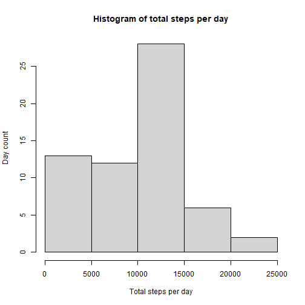
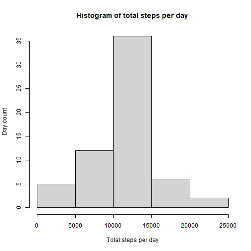

# Analyzing activity monitoring data

In this assignment, we will process and analyze activity monitoring data (number of steps) from one person's activity during the months of October and November 2012. The data is available for 5-minute intervals in the two-month period.

## Loading and preprocessing the data

Assume that the file activity.zip is available in your source directory, and when unzipped contains a comma-separated file activity.csv with three columns:

* steps: The integer number of steps recorded in the interval
* date: A character string representing the date of the interval
* interval: An integer representing the interval, in the format hhmm (example 130 is equal to 1:30am)

Let's first read the data into a data frame ```activity```, and change the class of the date field.

```r
unzip("activity.zip")
activity <- read.csv("activity.csv", header = TRUE)
activity$date <- as.POSIXlt(activity$date, tz = "", format = "%Y-%m-%d")
```

## What is mean total number of steps taken per day?

As a first exploration of the data, let's split the data set by date, calculate the total steps taken per day, and then run some summary statistics.


```r
totalsteps <- sapply(split(activity, as.Date(activity$date)), function(i) {sum(i$steps, na.rm = TRUE)})
summary(totalsteps)
```

```
##    Min. 1st Qu.  Median    Mean 3rd Qu.    Max. 
##       0    6778   10395    9354   12811   21194
```

```r
hist(totalsteps, xlab = "Total steps per day", ylab = "Day count", main = "Histogram of total steps per day")
```



We observe that the mean total number of steps taken per day, is equal to 9354.2295082, and the median 10395.

## What is the average daily activity pattern?

In order to understand the average daily activity pattern, let's calculate the average number of steps per interval, and plot this in a time series


```r
averagesteps <- sapply(split(activity, activity$interval), function(i) {mean(i$steps, na.rm = TRUE)})
plot(unique(activity$interval), averagesteps, type = "l", xlab = "Interval", ylab = "Average number of steps")
```


```r
maxinterval <- which.max(averagesteps)
nameinterval <- unique(activity$interval)[maxinterval]
maxaverage <- averagesteps[maxinterval]
```

We can observe that the maximum number of steps, on average, occurs in the 835 interval, with an average of 206.17 number of steps.

## Imputing missing values

In order to check the completeness of the dataset, let's have a look at any NA values. For the NA values, we then move on to replace them with the integer-coerced averages for the interval, as calculated above.


```r
totalNA <- sum(is.na(activity$steps))
totalNA
```

```
## [1] 2304
```

```r
## Replace missing values by the integer-coerced average for the interval during the 2-month period, create an 
## independent dataset named activity.complete
steps <- replace(activity$steps, is.na(activity$steps), as.integer(averagesteps))
activity.complete <- cbind(steps, activity[,2:3])
head(activity.complete)
```

```
##   steps       date interval
## 1     1 2012-10-01        0
## 2     0 2012-10-01        5
## 3     0 2012-10-01       10
## 4     0 2012-10-01       15
## 5     0 2012-10-01       20
## 6     2 2012-10-01       25
```

```r
## Calculate total steps per day with the independent dataset
totalsteps.complete <- sapply(split(activity.complete, as.Date(activity.complete$date)), function(i) {sum(i$steps, na.rm = TRUE)})
summary(totalsteps.complete)
```

```
##    Min. 1st Qu.  Median    Mean 3rd Qu.    Max. 
##      41    9819   10641   10750   12811   21194
```

```r
hist(totalsteps.complete, xlab = "Total steps per day", ylab = "Day count", main = "Histogram of total steps per day")
```



We observe that the independent dataset has a more bell-shaped distribution than the original dataset, which is natural given the strategy we implemented to replace missing values. The means and medians increase slightly, given the fact that the NA values replaced were mostly low values in the "steps" field.

## Are there differences in activity patterns between weekdays and weekends?

Using the dataset with the replaced missing values, we proceed to analyze differences between activity patterns on weekdays and weekends, using the weekdays() function. In this example, we will load and use the ```ggplot2``` and ```reshape2``` packages, make sure they are installed.


```r
library(ggplot2)
```

```
## Need help? Try Stackoverflow: https://stackoverflow.com/tags/ggplot2
```

```r
library(reshape2)

## Define weekdays and add a logical value = 1 for weekdays in the activity.complete dataframe
weekdays.list <- c("Monday","Tuesday","Wednesday","Thursday","Friday")
activity.complete["Weekday"] <- weekdays(activity.complete$date) %in% weekdays.list


## Calculate averages by interval and weekday
split.act <- split(activity.complete, activity.complete$Weekday)
averages <- data.frame(unique(activity.complete$interval))
colnames(averages) <- "Interval"
averages["Weekday"] <- sapply(split(split.act[[2]], split.act[[2]]$interval), function(i) {mean(i$steps)})
averages["Weekend"] <- sapply(split(split.act[[1]], split.act[[1]]$interval), function(i) {mean(i$steps)})

## Melt the dataframe using the reshape2 library "melt" function
data <- melt(averages, id.vars = c("Interval"), measure.vars = c("Weekday", "Weekend"))

## Generate two time series in a faceted plot, split on the Weekday field
ggplot(data, aes(Interval, value)) +
        facet_grid(rows = vars(variable)) +
        geom_line() +
        geom_point() +
        ggtitle("Activity levels on weekdays and weekends") + 
        xlab("Interval 0:00 - 23:55 (e.g. 500 = 5:00am)") + 
        ylab("Average number of steps in interval")
```


